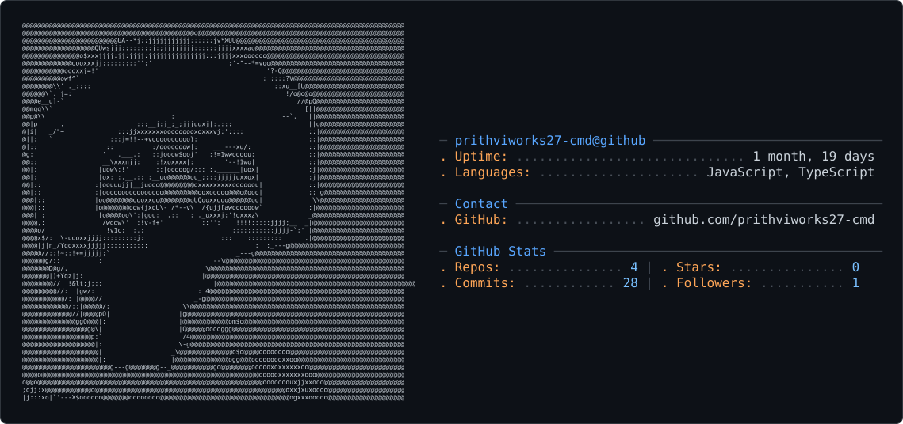

<picture>
  <source media="(prefers-color-scheme: dark)" srcset="dark_mode.svg" />
  <source media="(prefers-color-scheme: light)" srcset="light_mode.svg" />
  
</picture>

### 🔭 Currently building
- 📊 **CBSE Dashboards** — student performance tracking dashboards for classes 10 & 11
- 🎙️ **NOAH (Cognify Institute)** — an AI-powered voice oral examiner with PDF/OCR test paper upload and 3D particle visuals
- 🚀 **SIH** — a project for Smart India Hackathon

### 🌱 Currently learning
- Python
- Git & GitHub workflows

### 🛠️ Tech Stack

---

📦 **6** public repositories · 🕒 Last updated: September 08, 2026, 10:21 AM IST
